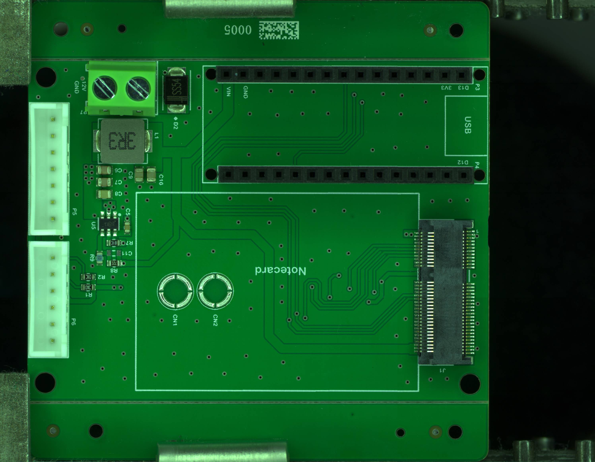

# biobot-hardware

Hardware for the BioBot wildfire sensor node: an open, low-cost module
placed at the forest edge to catch early signs of smoke. This repository
holds the carrier PCB design, fabrication outputs, and photos of the
assembled board. Firmware lives in
[biobot-firmware](https://github.com/biobotproject-org/biobot-firmware).

Licensed under the CERN Open Hardware Licence v2, Permissive
(CERN-OHL-P-2.0). See `LICENSE.txt`.

## The board: Fire Detection Device, rev A



Rev A is a carrier board. It does not contain a microcontroller or a
radio of its own; it holds off-the-shelf modules and gives them clean
power and sensor connectors.

| Function | Part | Reference |
| --- | --- | --- |
| Microcontroller | Arduino Nano ESP32 on two 15-pin headers | P3, P4 |
| Cellular modem | Blues Notecard, M.2 Key E socket | J1 |
| External SIM | Nano-SIM push-push holder with ESD protection | J2, D1 |
| Environmental sensor | Bosch BME688 breakout, 6-pin JST-XH | P6 |
| Particulate sensor | Bosch BMV080 breakout, 7-pin JST-XH | P5 |
| Power input | 12 V, 2-pin 5.08 mm screw terminal | P7 |
| 5 V regulator | TI TPS563201 buck, 3 A | U5 |

Schematic dated 15 June 2026, two-layer, assembled by JLCPCB. Source is
an Altium Designer project.

### Connector pinouts

**P5, BMV080 (7-pin JST-XH)**

| Pin | Signal | Notes |
| --- | --- | --- |
| 1 | IRQ | Routed to Nano D2, unused by firmware |
| 2 | AB0 | Address select, not connected |
| 3 | SCL | |
| 4 | SDA | |
| 5 | 3V3 | From the Nano's 3.3 V rail |
| 6 | GND | |
| 7 | AB1 | Address select, not connected |

**P6, BME688 (6-pin JST-XH)**

| Pin | Signal | Notes |
| --- | --- | --- |
| 1 | SCL | |
| 2 | SDA | |
| 3 | 3V3 | |
| 4 | GND | |
| 5 | CSB | Not connected, I2C mode |
| 6 | SDO | Not connected, address set on the breakout |

**P7, power (2-pin screw terminal)**

| Pin | Signal |
| --- | --- |
| 1 | 12 V |
| 2 | GND |

**Nano ESP32 signals used by the board**

| Nano pin | Use |
| --- | --- |
| A4 | I2C SDA, shared by Notecard, BME688, BMV080. 10 kΩ pull-up R1 |
| A5 | I2C SCL. 10 kΩ pull-up R2 |
| D2 | BMV080 IRQ |
| 3V3 | Notecard VIO and both sensor headers |
| VIN | 5 V from the buck regulator |

### Power path

12 V arrives at P7, passes an SS54 Schottky to ground as a reverse
clamp, and feeds the TPS563201. The feedback divider (54.9 kΩ / 10 kΩ)
sets 5.0 V. The 5 V rail feeds the Nano's VIN and the Notecard's
VMODEM pins. Everything at 3.3 V comes from the Nano's onboard
regulator.

The board assumes an external 12 V source, for example a 12 V LiFePO4
battery behind an off-the-shelf solar charge controller with a load
output. There is no charger, no fuel gauge, and no solar input on the
board.

### Known issues, planned for rev B

- No battery voltage sensing. Add a divider from 12 V to a spare ADC pin
  so the node can report battery state.
- The Nano ESP32 VIN pin is specified for 6 to 21 V and is fed 5 V.
  Verify on the bench or move the Nano's supply.
- Reverse polarity protection is a shunt diode with no fuse. Add a
  polyfuse or a P-FET, and a TVS on the 12 V input.
- Notecard ATTN and AUX pins are not routed. ATTN to a GPIO is needed for
  deep-sleep wake.
- No load switch on the sensor 3.3 V rail, so the particulate sensor
  cannot be duty-cycled.
- No antenna provision. The Notecard's u.FL connectors need a pigtail to
  a bulkhead LTE antenna on the enclosure.
- Inductor L1 is labelled "3.3uF" in the schematic and BOM; it is 3.3 µH.
- The schematic title block is blank.

## Ordering

Upload `pcb/fire-detection-device/fabrication/gerber.zip` to JLCPCB and
add `bom.csv` and `pick-and-place.csv` for assembly. Part numbers in the
BOM are LCSC codes. The Nano ESP32, Notecard, SIM, and sensor breakouts
are bought separately and plugged in.

## Repository layout

```
pcb/fire-detection-device/source/       Altium project, schematic, layout, libraries
pcb/fire-detection-device/fabrication/  gerbers, BOM (xlsx and csv), pick-and-place
pcb/fire-detection-device/docs/         schematic PDF, render, assembly photos
archive/kicad-2025-11/                  abandoned first attempt in KiCad, kept for history
```
